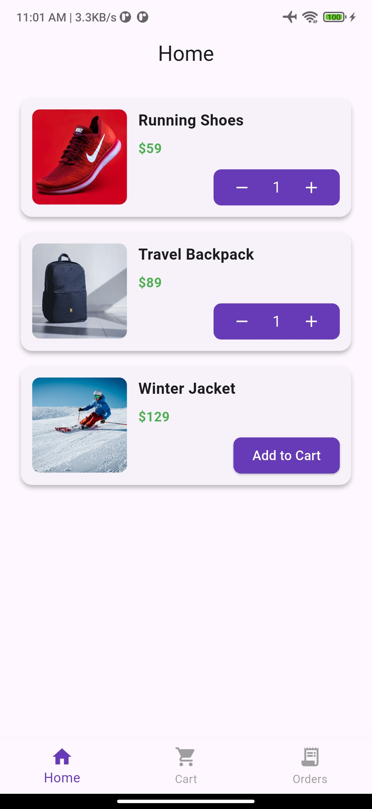
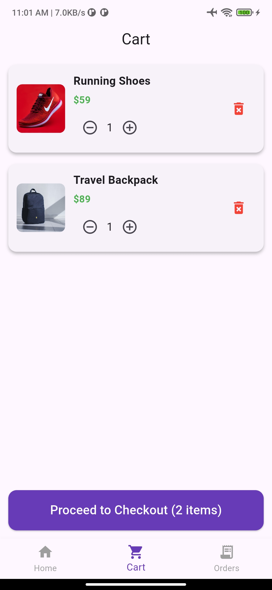
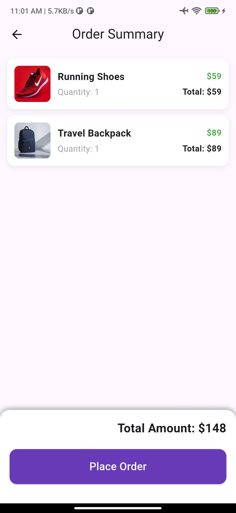
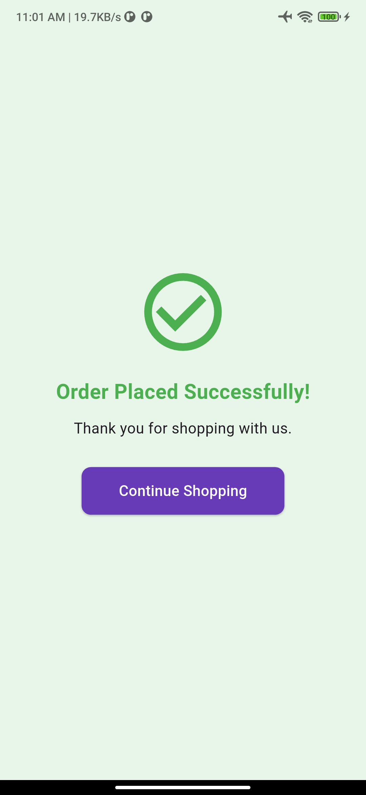
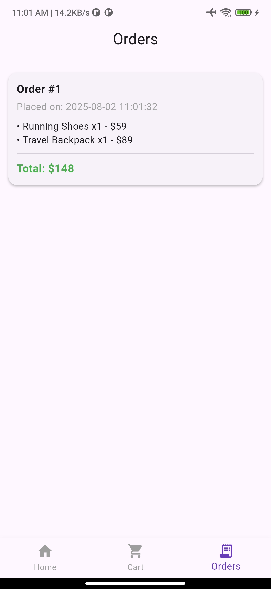

---

# 🛒 EcomApp

A fully functional **Flutter E-commerce App** built using **GetX** for state management, navigation, and dependency injection.
This app follows **Clean Architecture** principles to ensure scalability, maintainability, and testability.

---

## ✨ Features

* ✅ Product list fetched from **live API** using **Dio**
* 🛍 Add to cart, update quantity, and remove items
* 💰 Checkout with real-time order summary and total calculation
* 📦 Order status confirmation (success/failure)
* 🔁 Bottom navigation bar with persistent state
* 🧼 Clean code architecture with well-separated layers

---

## 📂 Project Structure

lib/
├── controller/               # GetX controllers (Home, Cart, Navigation)
├── data/                     # Data layer (API, models, repositories)
│   ├── datasources/
│   ├── model/
│   └── repositories/
├── domain/                   # Business logic (Entities, Use Cases, Interfaces)
├── presentations/            # UI Screens & Widgets
│   ├── bindings/
│   ├── pages/
│   └── widgets/
├── routes/                   # App routes and route names
└── main.dart                 # Entry point

---

## 🧠 Architecture (Clean)

* **Presentation Layer** → UI + GetX Controllers
* **Domain Layer** → Business Rules (Entities, UseCases, Interfaces)
* **Data Layer** → Actual Data Fetching (API, Models, Repos)

---

## 🚀 Getting Started

### ✅ Prerequisites

* Flutter installed → [Flutter Install Guide](https://docs.flutter.dev/get-started/install)

### 💻 Run locally

git clone https://github.com/your-username/ecomapp.git
cd ecomapp
flutter pub get
flutter run

---

## 🔌 API

This app fetches product data from a mock API:
🔗 [https://mocki.io/v1/770c86fa-0434-4555-a5e9-17486a5ede7c](https://mocki.io/v1/770c86fa-0434-4555-a5e9-17486a5ede7c)

---

## 🧪 Tech Stack

| Tool                  | Purpose                                            |
| --------------------- | -------------------------------------------------- |
| 🧩 Flutter            | UI Development                                     |
| ⚡ GetX                | State Management, Navigation, Dependency Injection |
| 🌐 Dio                | API calls                                          |
| 🧱 Clean Architecture | Scalable project structure                         |

---

## 📸 Screenshots

  
  
  
  
  

---

## 🤝 Contributions

Contributions, issues, and feature requests are welcome!

1. Fork the project
2. Create your feature branch

  
   git checkout -b feature/AmazingFeature
  
3. Commit your changes

   git commit -m 'Add some AmazingFeature'
 
4. Push to the branch

   git push origin feature/AmazingFeature
 
5. Open a pull request

---

## 👨‍💻 Author

Made with ❤️ by **\[Mohamed Isaam]**

---
